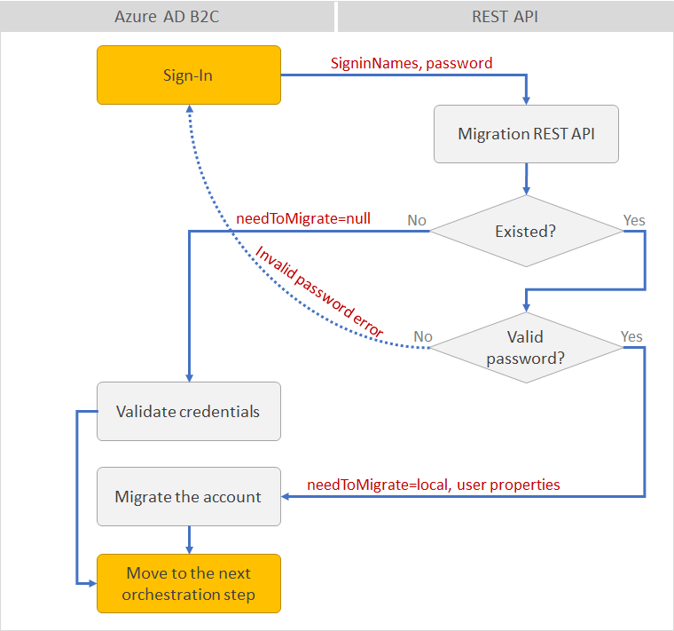
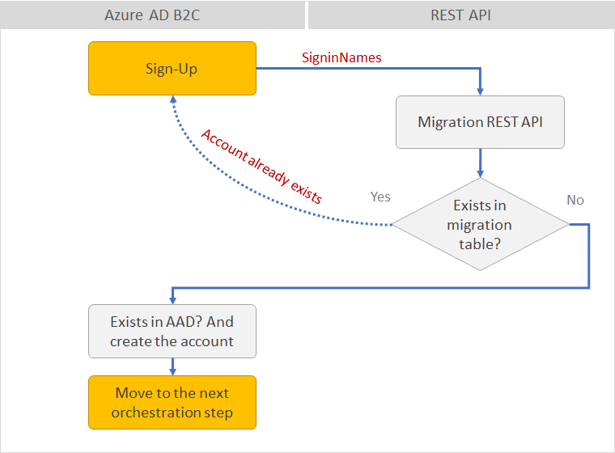
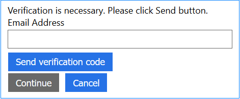
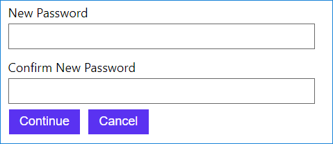

# Azure AD B2C: Just in time user migration v2
When you plan to migrate your identity provider to Azure AD B2C, you may also need to migrate the users account as well. This article explains how to migrate existing user accounts with their passwords and profiles, from any identity provider database to Azure AD B2C.

Just in time migration flow fits when the user's password is not accessible. For example:
* Passwords are in HASH format
* Passwords are stored in an identity provider, which you don't have access. Your system validates user credential by calling an identity provider web service

## Just in time migration flow
Just in time migration deals with following scenarios:

 ### Sign-in
1. **SelfAsserted-LocalAccountSignin-Email** technical profile calls the migration REST API endpoint, **REST-UserMigration-LocalAccount-SignIn** technical profile, sending **SigninNames** and **password** claims, as input parameters. 
1. The REST API, checks if the user exists in the legacy identity provider. In this example Azure Blob Table.
1. If exists, REST API checks if the password provided by the user is valid (compare password or call the legacy identity provider). 
    1. If valid the REST API returns the user profile from the migration table with **needToMigrate** claim set to `local`. 
    1. If not valid, the REST API return an error 'Your password is incorrect'.
    1. If user is not existed in the legacy identity provider, the REST API returns empty claims (**needToMigrate** claim is null)
1. The **SelfAsserted-LocalAccountSignin-Email** technical profile checks the return **needToMigrate** claim. 
    1. If the claim is null, Azure AD B2C invokes the next validation technical profile **login-NonInteractive**, which validates the user credential (this user already existed in the directory). 
    1. Otherwise, Azure AD B2C invokes the next validation technical profile **AAD-MigrateUserUsingLogonEmail**, which migrates the account with the information return from the migration REST API.



### Sign-up
For the sign-up the policy needs to check whether a user with such email address  exists in Azure AD and also in the migration table. To do so, the **LocalAccountSignUpWithLogonEmail** technical profile:
 1. Calls the migration REST API endpoint, **REST-UserMigration-LocalAccount-SignUp** technical profile, sending `SigninNames`claims. 
 1. The REST API checks if the user exists in the migration table. 
 1. If exists, return an error message 'A user with the specified ID already exists. Choose a different one.'
 1. Otherwise, B2C continues to the next validation technical profile **AAD-UserWriteUsingLogonEmail** that checks if user already exists in AAD and creates the account.




### Password reset
The password reset flow includes two pages. In the first page (**LocalAccountDiscoveryUsingEmailAddress** self-asserted technical profile) asks the user to provide and verify the email address. This technical profile:



1. Calls the **AAD-UserReadUsingEmailAddress** validation technical profile that looks up the user in AAD. While continuing on error (user not found), which means this user is a migrated one.
1. Then also makes a call to the **REST-UserMigration-LocalAccount-PasswordReset1** validation technical profile, while sending the **objectId**. The REST API checks if user exists in the migration table, or if **objectId** is null. Raise an error is user is not existed in AAD or migration table.

On the second page, **LocalAccountWritePasswordUsingObjectId** self-asserted technical profile, user provides the new password and click continue.


 
1. For existing account (**objectId** is not null) Call **AAD-UserWritePasswordUsingObjectId** validation technical profile that updates the new password. 
1. For migrate account (**objectId** is  null) 
    1. Call **REST-UserMigration-LocalAccount-PasswordReset2** validation technical profile that returns the migrate user data. 
    1. Call **AAD-MigrateUserUsingLogonEmail** validation technical profile that creates the account in the directory.
 

## Unit tests
You should run at least following tests:

|Test |Flow  |Expected result  |
|---------|---------|---------|
|1 |Sign-in with local account wrong password     |Error message: Your password is incorrect         |
|2 |Sign-in with local account valid credentials     |B2C issues an access token         |
|3 |Sign-in with invalid account     | Error message: We can't seem to find your account        |
|4 |Sign-in with migrate account wrong  credentials     |Error message: Your password is incorrect (migration API)         |
|5 |Sign-in with migrate account valid credentials     |User is migrated         |
|6 |Sign-in again with the same user and password     |B2C issues an access token         |
|7 |Sign-Up with existing local account     |Error message: A user with the specified ID already exists. Choose a different one.         |
|8 |Sign-Up with existing migration account     |Error message: A user with the specified ID already exists. Choose a different one. (migration API)         |
|9 |Sign-Up with new account     |B2C creates the account in the directory         |
|10 |Password reset for non-existing local and migrated account |Error message: An account could not be found for the provided user ID. (migration API)         |
|11 |Password reset for local account   |Password is reset.         |
|12 |Try to sign-in again with the new password     |B2C issues an access token         |
|13 |Password reset for migrated account     |User is migrated (check the users list in Azure Portal)         |
|14 |Try to sign-in again with the new password     |B2C issues an access token         |


## Just in time migration .Net core solution

### Migration database
This demo web API illustrates a case when username and password (in HASH format) are stored in Azure Tables. Azure table serves as your legacy identity provider. You can change to code to work directly with your legacy identity provider. Or export the data to Azure Table.

Populate the table with dummy data. Call following endpoint (replace URL to fit your deployment):
`http://your-app.azurewebsites.net/api/test/PopulateMigrationTable`

> Note: You can customize the Restful service to accommodate your own business logic. For example, validate user credential against SQL database, No-SQL or calling remote web services. The idea is the same: if the password provided by user is valid, update the AAD account and remove the entity.

### Application Settings
To test the demo Restful API. Open the `AADB2C.JITUserMigration.sln` Visual Studio solution in Visual Studio. In the `AADB2C.JITUserMigration` project, open the `appsettings.json`. Replace the app settings with your own values:
```JSON
"AppSettings": {
    "BlobStorageConnectionString": "<Your connection string to Azure Table that stores your identities to be migrated>"

  }
```


## Run the solution
To run the visual studio solution, you need:
1. Deploy this web app to Azure App Services. For more information, see [Create and publish the web app](https://docs.microsoft.com/en-us/azure/app-service/app-service-web-get-started-dotnet#create-and-publish-the-web-app)
1. Set the application settings. You can set the app settings directly from `launchSettings.json` file. Or use the better solution, from Azure portal. For more information, see: [Configure web apps in Azure App Service](https://docs.microsoft.com/en-us/azure/app-service/web-sites-configure#application-settings)
1. Open the policies files, change the tenant name, client_id and IdTokenAudience for Local Account sign-in, and upload the policies to Azure portal.

### Important notes:
Secure the communication between Azure AD B2C to your Rest API. For more information, see: [Secure your RESTful service by using client certificates](https://docs.microsoft.com/en-us/azure/active-directory-b2c/active-directory-b2c-custom-rest-api-netfw-secure-cert) OR [Secure your RESTful services by using HTTP basic authentication](https://docs.microsoft.com/en-us/azure/active-directory-b2c/active-directory-b2c-custom-rest-api-netfw-secure-basic)

## Solution artifacts
### Azure AD custom policy

This sample policy is based on [LocalAccounts starter pack](https://github.com/Azure-Samples/active-directory-b2c-custom-policy-starterpack/tree/master/SocialAndLocalAccounts). 
   * All changes are marked with **Demo:** comment inside the policy XML files.
   * Make the necessary changes in the **Action required** comments

### Visual studio solution
* **UserMigrationController** The custom policy calls this REST API
* **TestController** populate the Azure Table with migration dummy data.
* **appsettings.json** application settings
* **Models** folder - this folder contains the necessary object-mapping classes 


## Disclaimer
The migration application is developed and managed by the open-source community in GitHub. The application is not part of Azure AD B2C product and it's not supported under any Microsoft standard support program or service. This migration app is provided AS IS without warranty of any kind.
